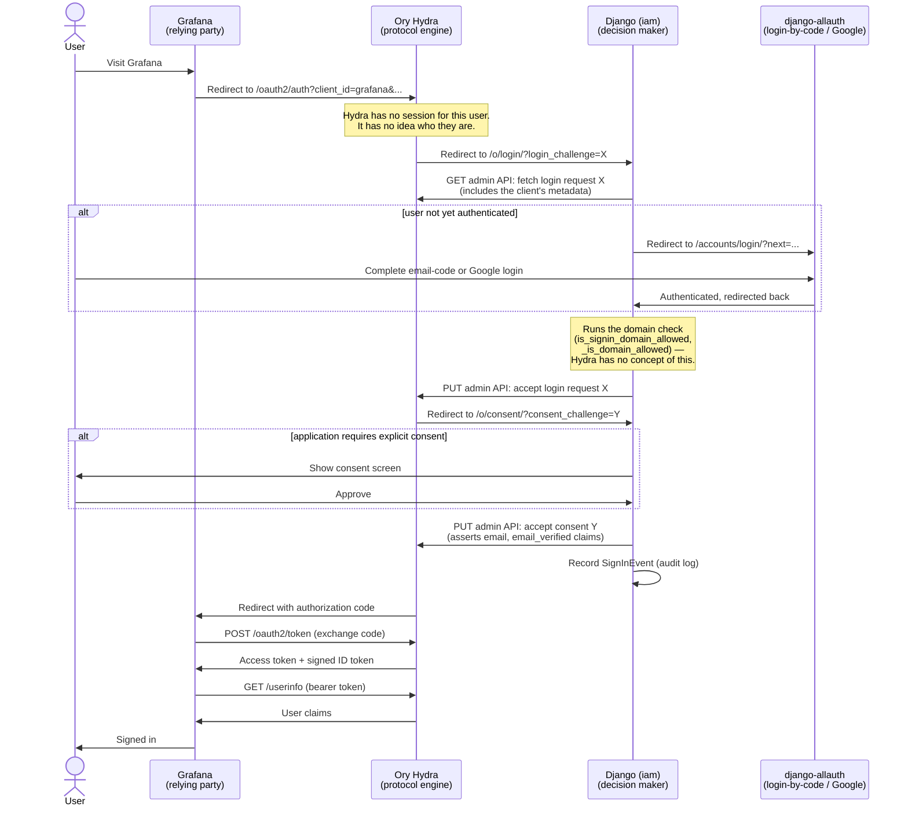

> [!IMPORTANT]  
> This private project is just-for-fun, no part of it is used or otherwise endorsed in UK Gov


## prototype-gov-signin — Django + Ory Hydra Identity Provider

A Django service that acts as an OpenID Connect identity provider for internal tools. Teams register their applications here and get a client ID and secret; their applications then authenticate users via the standard OIDC authorization code flow.

Built on two systems that each own one half of the authentication picture: Django (via django-allauth) handles who a human is, and [Ory Hydra](https://www.ory.sh/hydra/) — a dedicated OAuth2/OIDC server — handles the protocol: token issuance, signing keys, discovery, and session lifecycle. This app never signs a token itself; it only ever tells Hydra, via its admin API, whether a given sign-in should be allowed to proceed.

---

## Architecture: Django vs Hydra

Neither side trusts the other's data model. Hydra knows nothing about Teams, email domains, or this project's business rules. Django knows nothing about token signing, client secrets, or OAuth2 protocol correctness. The split:

| | Django (`iam`) | Ory Hydra |
|---|---|---|
| **Owns** | Authentication (who is this person), authorization (may they proceed), business data (Teams, domains, application metadata), the audit log | Token issuance, signing keys, the OAuth2/OIDC endpoints, the client registry, login/consent/logout session state |
| **Has no idea about** | How to sign a token, or a client secret's lifecycle | Users, teams, domains, or any of this project's rules |
| **Talks to the relying party** | Never — Grafana never sends a request to Django | Directly — `/oauth2/auth`, `/oauth2/token`, `/userinfo` |
| **Talks to the other side via** | Hydra's **admin API** (`HYDRA_ADMIN_URL`) — to accept/reject a login or consent, and to manage clients | Browser **redirects** carrying a `login_challenge`/`consent_challenge`/`logout_challenge` — never calls Django's admin API |

The admin API is the trust boundary: whoever can reach `HYDRA_ADMIN_URL` can accept a login as any user, so it is never exposed outside the deployment network (see `docker-compose.yml`).

### Sequence: a user signing in to Grafana



Three things worth noting about this flow:

- **Django never sees a token, and Hydra never sees a Team.** The only data that crosses the boundary is the challenge IDs (opaque, short-lived) and the claims Django hands Hydra to put in the ID token (`email`, `email_verified`, `sub`).
- **The domain check runs on every login-challenge**, not just once — so a user who's authenticated to Django (has a session) but whose team's allowed domains have since changed is re-checked each time they try to reach an application, at step "Runs the domain check" above.
- **Hydra's defaults are slightly broader than what this deployment supports** (it will accept `plain` PKCE, and its discovery document lists grant/response types this app never issues). Django narrows this at two points: `_reject_weak_pkce` rejects `plain` at the login-challenge step, and `DiscoveryInfoView` trims the proxied discovery document — see [Ory Hydra](#ory-hydra--how-other-services-authenticate-their-users) below.

---

## django-allauth — how users log in to *this* service

[django-allauth](https://github.com/pennersr/django-allauth) handles the inbound side: getting a human being authenticated into the IAM service itself.

This project uses **login-by-code** (passwordless email). A user submits their email address, receives a one-time code, and enters it to complete sign-in. There is no password.

```
user visits /o/teams/
  → redirected to /accounts/login/
  → submits email at /accounts/login/code/
  → receives code by email (via Mailpit in dev)
  → submits code at /accounts/login/code/confirm/
  → authenticated, returned to original destination
```

**Auto-enrolment.** On a fresh database no accounts exist. Rather than requiring a separate sign-up step, the service automatically creates an account the first time an email address is submitted (provided that address is permitted to sign in — see [Who can sign in](#who-can-sign-in)). This is implemented in `iam/users/forms.py` via a custom `RequestLoginCodeForm` subclass registered under `ACCOUNT_FORMS` in settings. The created account has no usable password and a verified email address.

**No usernames.** The custom `User` model has no username field; the email address is the identifier (`USERNAME_FIELD = "email"`). allauth is configured accordingly with `ACCOUNT_USER_MODEL_USERNAME_FIELD = None`.

**Relevant settings:**

```python
ACCOUNT_LOGIN_BY_CODE_ENABLED = True
ACCOUNT_FORMS = {"request_login_code": "users.forms.AutoEnrollRequestLoginCodeForm"}
ACCOUNT_USER_MODEL_USERNAME_FIELD = None
ACCOUNT_LOGIN_METHODS = {"email"}
ACCOUNT_SIGNUP_FIELDS = ["email*"]
```

**Google social login** is fully wired and activates whenever `GOOGLE_CLIENT_ID` and `GOOGLE_CLIENT_SECRET` are set (the login page shows a "Sign in with Google" button, with the email code flow kept as the fallback for users without a Google account). When either is unset, the Google provider is not registered at all (see `GOOGLE_LOGIN_ENABLED` in `iam/settings.py`) — the button doesn't render and `/accounts/google/login/` 404s, rather than the button rendering and crashing on click. The OAuth client in the Google console must have `<origin>/accounts/google/login/callback/` registered as a redirect URI for each environment. Because Google only asserts verified email addresses, `SOCIALACCOUNT_EMAIL_AUTHENTICATION` is enabled: a Google login whose email matches an existing account (for example one created by the email code flow) signs in to that account and links the Google account to it, rather than creating a duplicate.

In docker compose, "Google" is actually [Dex](https://dexidp.io/) (`integration_tests/dex.yaml`): allauth's Google adapter allows each endpoint URL to be overridden (`GOOGLE_AUTHORIZE_URL`, `GOOGLE_ACCESS_TOKEN_URL`, `GOOGLE_ID_TOKEN_ISSUER`), so the stack exercises the production Google code path without real credentials. Sign in as `dex-user@example.com` / `password`. The integration tests cover this flow; against real Google, only a one-off manual check of the console configuration is needed.

---

## Ory Hydra — how *other services* authenticate their users

[Ory Hydra](https://www.ory.sh/hydra/) handles the outbound side: making this identity provider an OpenID Certified OAuth 2.0 / OIDC authorization server that other applications can trust. Hydra owns token issuance, signing keys, session lifecycle, and the standard OIDC endpoints; this Django app is not the token issuer — it is the thing Hydra delegates every login and consent decision to.

When a service like Grafana needs to know who a user is, it redirects them to Hydra's `/oauth2/auth` endpoint. Hydra has no user database of its own, so it redirects the browser onward to this app's **login-challenge** endpoint, carrying a `login_challenge` id. This app decides whether the user may proceed (running exactly the same domain checks described below), then calls Hydra's admin API to accept or reject that decision. Hydra then repeats the pattern for **consent**, and finally issues the authorization code, tokens, and ID token itself.

```
user visits Grafana
  → Grafana redirects to Hydra's /oauth2/auth?client_id=grafana&...
  → Hydra has no session for this user, redirects to this app's /o/login/?login_challenge=...
  → user authenticates via allauth (above), if not already
  → this app runs the domain check (below) and calls Hydra's admin API to accept/reject the login
  → Hydra redirects to this app's /o/consent/?consent_challenge=...
  → this app shows a consent screen (or auto-approves, if skip_authorization is set) and tells Hydra
  → Hydra issues an authorization code to Grafana
  → Grafana exchanges the code with Hydra directly (POST Hydra's /oauth2/token)
  → Grafana calls Hydra's /userinfo directly to get user claims
  → user is logged in to Grafana
```

Hydra exposes the standard OIDC endpoints directly (not proxied through this app), at `HYDRA_PUBLIC_URL`:

| Endpoint | Purpose |
|---|---|
| `/oauth2/auth` | Authorization endpoint — starts the flow |
| `/oauth2/token` | Token endpoint — exchanges code for tokens |
| `/userinfo` | Returns claims for the bearer token |
| `/.well-known/openid-configuration` | Discovery document |
| `/.well-known/jwks.json` | Public keys for token verification |

This app additionally proxies a trimmed discovery document at `/o/.well-known/openid-configuration` (see `DiscoveryInfoView` in `iam/users/views.py`), which narrows the `response_types`/`grant_types`/PKCE fields Hydra otherwise advertises down to what this deployment actually honours (authorization-code only, S256-only PKCE).

**Teams and application management.** Applications are OAuth2 clients registered in Hydra — there is no local database table for them (see `iam/users/hydra.py`, a thin wrapper around Hydra's admin API). Team ownership is recorded on the Hydra client itself (its `owner` field, set to the team's id); everything else this project layers on top of a bare OAuth2 client — description, main app URL, the `additional_emails` allow-list, the `listed`/`is_active` flags — is stored in Hydra's free-form `metadata` field. Teams manage their applications, members, and allowed email domains under `/o/teams/` (views in `iam/users/views.py`). Users and teams are many-to-many via a `Membership` model.

**Domain restriction.** Each team can whitelist email domains (`AllowedEmailDomain`), which apply to all of its applications. Matching is by suffix, so allowing `cabinetoffice.gov.uk` also admits `digital.cabinetoffice.gov.uk`. A team with no domains configured allows **no** users (fail closed) — every domain you want to permit must be added explicitly, so access is never opened to everyone by accident. `HydraLoginView` in `iam/users/views.py` intercepts Hydra's login-challenge redirect and returns 403 if the authenticated user's email domain is not allowed (an application can still list individual `additional_emails` that bypass the domain check).

Note that the check applies **only at the login-challenge step**: removing a domain does not revoke access or refresh tokens that were already issued, and relying parties keep their own sessions. A user who loses access stays signed in to downstream applications until their tokens expire.

This per-application check is distinct from the global sign-in gate that decides whether a user can authenticate to *this* service at all (admins, `.gov.uk`, or any team's allowed domains) — see [Who can sign in](#who-can-sign-in).

**Relevant settings:**

```python
HYDRA_ADMIN_URL = "http://hydra:4445"   # never exposed outside the deployment network
HYDRA_PUBLIC_URL = "http://hydra:4444"  # used only to proxy the discovery document
```

Hydra manages its own signing keys and database — there is no equivalent of an `oidc.key` file for this app to generate or provide; that entire concern moved to Hydra (see `docker-compose.yml` for how it's configured locally).

---

## Running locally

Prerequisites: [Docker](https://docs.docker.com/get-docker/) and [uv](https://docs.astral.sh/uv/).

Start the stack:

```
make up
```

This starts:
- **iam** — the Django service on port 8000 (decides logins/consent; never issues tokens itself)
- **hydra** — the OAuth2/OIDC authorization server on ports 4444 (public) and 4445 (admin)
- **db** — Postgres 17 (a single server, with separate databases for `iam` and `hydra`)
- **mailpit** — catches outbound email; web UI at http://localhost:8025
- **grafana** — a pre-configured demo relying party at http://localhost:3000
- **dex** — a local OIDC server standing in for Google on port 5556 (see the Google social login section)

On first start, the `iam` service (see `docker-compose.yml`) seeds a demo user and registers a Grafana OAuth client in Hydra. Log in to Grafana with "Sign in with IAM", complete the email code flow in Mailpit, and you will land in Grafana authenticated.

## Configuration

The `SECRET_KEY` environment variable is always required — there is no fallback and the service refuses to start without one. `DEBUG` defaults to **false**; when false, HTTPS-only cookies and SSL redirect are enabled, and `ALLOWED_HOSTS` (comma-separated, e.g. `ALLOWED_HOSTS=iam.example.gov.uk`) becomes required — the service refuses to start without it, rather than booting and rejecting every request with HTTP 400. The dev entry points (`docker compose up`, `make run`, pytest) set `DEBUG=true` and an insecure dev `SECRET_KEY` for you (and under `DEBUG` Django supplies its own host fallback), so a deployed instance needs to set a real `SECRET_KEY` and `ALLOWED_HOSTS`, and leave `DEBUG` unset.

Outbound email picks a backend from the environment: if `GOVUK_NOTIFY_API_KEY` is set, codes are sent via GOV.UK Notify; otherwise if `EMAIL_HOST` is set, plain SMTP is used (docker compose points this at Mailpit); otherwise emails are printed to the console.

**Admin access** is config-driven via `ADMIN_USERS` — a comma-separated, case-insensitive list of emails (e.g. `ADMIN_USERS=alice@cabinetoffice.gov.uk,bob@cabinetoffice.gov.uk`). On each login, listed users are granted Django admin access (staff + superuser) and anyone no longer listed is demoted, so the env var is the single source of truth. Admins sign in to `/admin/` through the normal allauth flow (email code or Google); there is no admin password. Leaving `ADMIN_USERS` unset means the mechanism is inactive and existing flags are left untouched.

## Initial setup

A freshly deployed instance starts empty — no users, teams, or allowed domains. Bringing it up to a working state:

1. **Set the required configuration** (see [Configuration](#configuration)): `SECRET_KEY`, `ALLOWED_HOSTS`, `HYDRA_ADMIN_URL`/`HYDRA_PUBLIC_URL` (pointing at a running Hydra instance), the database, an email backend, and — important for bootstrapping — `ADMIN_USERS`.

2. **Run migrations.** The deploy entry points do this for you (the `Procfile` release phase; the container/compose start commands). Manually it is `cd iam && python manage.py migrate`.

3. **Sign in as the first admin.** Who may sign in at all is gated (see [Who can sign in](#who-can-sign-in) below), so a brand-new instance with no domains configured would otherwise have no way in. Two things open the door: any address listed in `ADMIN_USERS`, and any `.gov.uk` address. Go to `/accounts/login/` and complete the email-code flow; listed admins are granted Django admin access on login.

4. **Create the first team and its allowed domains.** There is no team-creation page in the app UI, so do this once in Django admin at `/admin/`:
   - add a **Team**;
   - add one or more **Allowed email domains** to it (e.g. `cabinetoffice.gov.uk`);
   - add **Memberships** for the people who will manage it.

   From then on, team members manage members, domains, and applications themselves under `/o/teams/`.

5. **Register applications.** A team member opens `/o/teams/`, selects the team, and registers an application to obtain its client ID and secret. Configure the relying party with those credentials and the OIDC endpoints listed above.

### Who can sign in

Signing in to the service at all is gated by a global allow-list, applied to both the email-code and Google flows before any account is created. An address is admitted if **any** of:

- it is listed in `ADMIN_USERS`;
- it is a `.gov.uk` address (matched on label boundaries, so `notgov.uk` does **not** qualify);
- its domain is allowed by **some** team (the union of every team's allowed domains).

Otherwise it is refused. The admin and `.gov.uk` allowances are the bootstrap escape hatches: on a fresh instance with no team domains yet, they are the only way in (without them, no one could sign in to configure the first team). This global gate is coarser than, and sits in front of, the per-application [domain restriction](#ory-hydra--how-other-services-authenticate-their-users) — passing it lets you hold an account here; each application still checks its own team's domains at the login-challenge step.

## Running tests

### Unit tests

```
make install
make db      # start Postgres (once; stays up for repeated runs)
make test
```

Tests run against PostgreSQL — the service requires it, with no SQLite fallback — and use the `locmem` email backend. `make db` starts the Postgres container the tests connect to. Ory Hydra is not run for the unit suite; its admin API is faked in-memory (see `tests/conftest.py`'s `fake_hydra` fixture) so the login/consent-challenge views can be exercised without a live Hydra instance. The full flow against a real Hydra is covered by the integration tests below and by `tests/test_oidc_flow.py`'s narrower in-process coverage.

### Integration tests (Playwright)

End-to-end browser tests in `integration_tests/` drive the full docker compose stack: login by email code (reading the code from Mailpit's API), the Grafana OIDC flow, and team/application management. They need the stack running (see [Running locally](#running-locally)):

```
make install-integration   # one-off: installs the integration deps + Chromium
make up                    # in a separate terminal, if not already running
make integration-test
```

The tests seed data (teams, users) by shelling into the running `iam` container with `docker compose exec`, so they must be run from the repository root against the compose stack — not against a bare `make run` server.

Both suites run in CI (`.github/workflows/ci.yml`); the integration job builds the compose stack on the runner, which includes standing up Ory Hydra and its own database.
